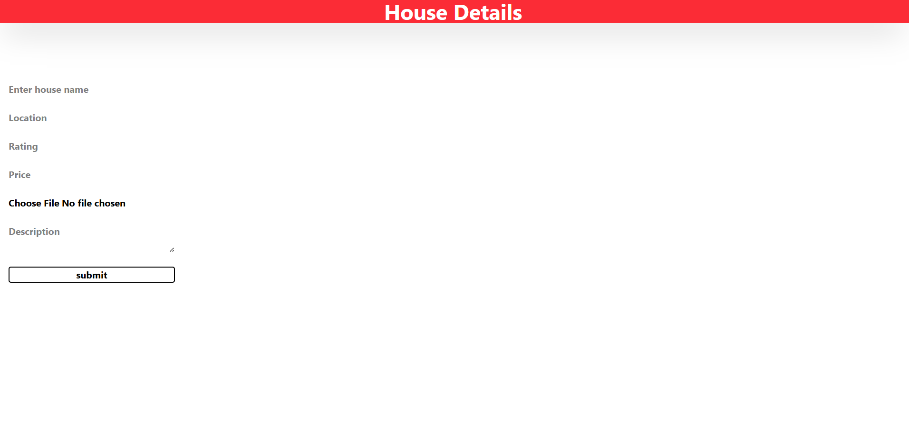
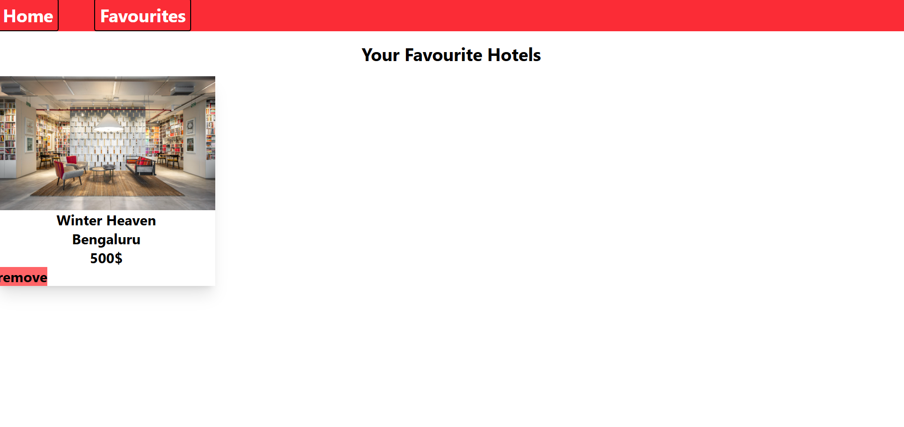

# HostSpace

A simple web application to showcase homes using **Node.js, Express, EJS, Tailwind CSS, and MongoDB**.  
Users can sign up, log in, add houses, view house details, mark favorites, and delete listings.

---

## 🛠 Tech Stack

- **Backend:** Node.js, Express.js  
- **Frontend:** EJS, Tailwind CSS  
- **Database:** MongoDB  
 
---

---

## 🖼 Screenshots

> Add screenshots in the `screenshots/` folder and reference them like this:

### Signup Page

### Home Page

### Add House Page

### Favorites Page

